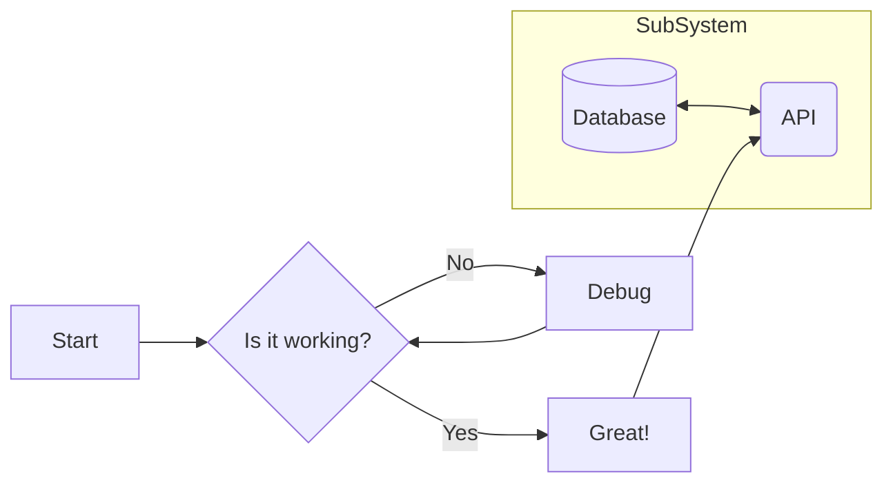

# Update Flowchart

## When to use this skill

Use this skill when creating a new Mermaid flowchart or updating an existing one. This covers syntax for nodes, shapes, links, subgraphs, and styling.

## Instructions

1.  **Start with `flowchart`**: Every flowchart must start with this keyword followed by the direction.
    -   `flowchart TD` (Top-Down)
    -   `flowchart LR` (Left-Right)
    -   `flowchart BT` (Bottom-Top)
    -   `flowchart RL` (Right-Left)
2.  **Define Nodes**:
    -   **Metadata Syntax**: `id@{ shape: <shape-name>, label: "label text" }`
    -   **Common Shapes**:
        -   `rect`: Rectangle (default)
        -   `rounded`: Rounded Rectangle
        -   `stadium`: Stadium
        -   `subroutine`: Subroutine
        -   `cyl`: Cylinder (Database)
        -   `circ`: Circle
        -   `dbl-circ`: Double Circle
        -   `diam`: Diamond (Decision)
        -   `hex`: Hexagon
        -   `lean-r` / `lean-l`: Parallelogram (Lean Right/Left)
        -   `trap-b` / `trap-t`: Trapezoid (Base Bottom/Top)
        -   `odd`: Odd Shape
        -   `event`: Event
        -   `proc`: Process
        -   `doc`: Document
        -   `manual-input`: Manual Input
        -   `manual-file`: Manual File
        -   `card`: Card
        -   `stored-data`: Stored Data
    -   *Note: Legacy syntax (e.g., `id[text]`) is still supported but metadata syntax is preferred for newer features.*
3.  **Define Links**:
    -   Solid: `A --> B`
    -   Dotted: `A -.-> B`
    -   Thick: `A ==> B`
    -   Open: `A --- B`
    -   With text:
        -   `A -->|text| B`
        -   `A -- text --> B`
        -   `A -. text .-> B`
        -   `A == text ==> B`
4.  **Special Characters**:
    -   Use quotes for text with special characters: `id["Text with (special) chars"]`
5.  **Subgraphs**:
    ```mermaid
    subgraph Title
        direction TB
        A --> B
    end
    ```
6.  **Styling**:
    -   `style id fill:#f9f,stroke:#333,stroke-width:4px`
    -   `classDef className fill:#f9f,stroke:#333`
    -   `class id className`

## Example


